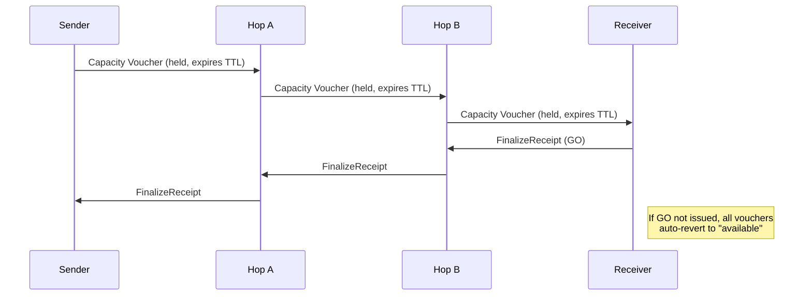
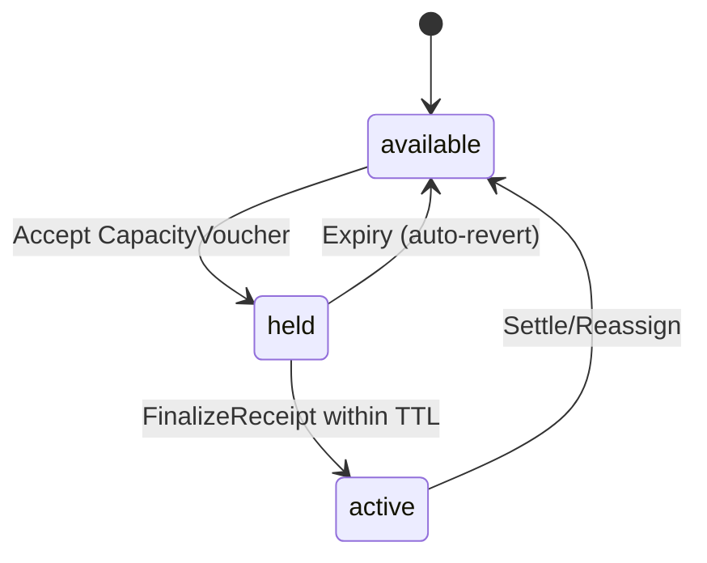
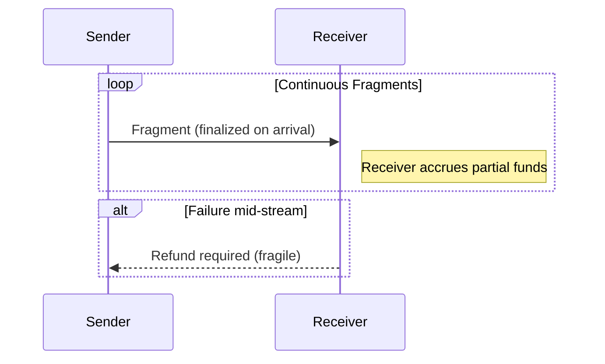
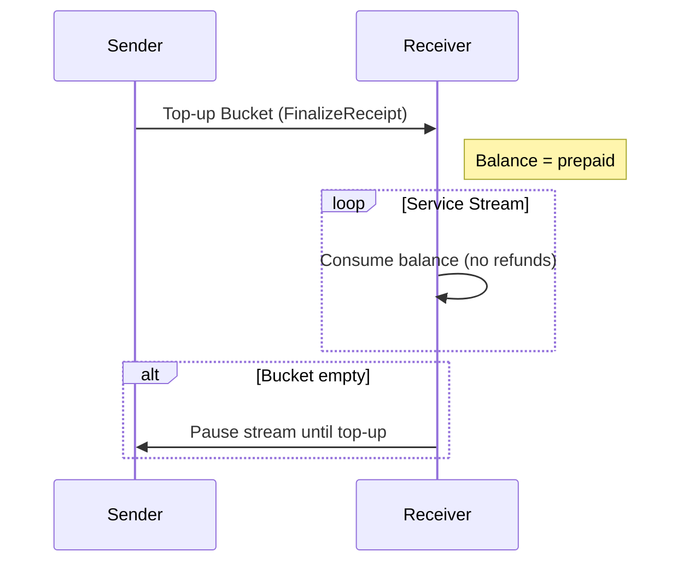
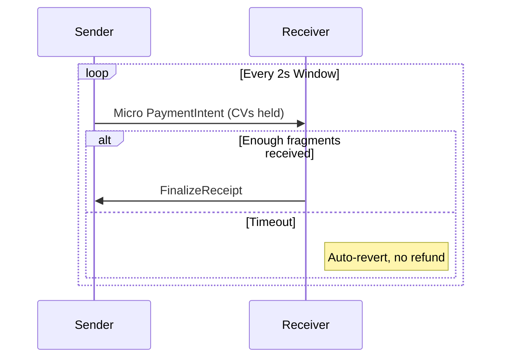
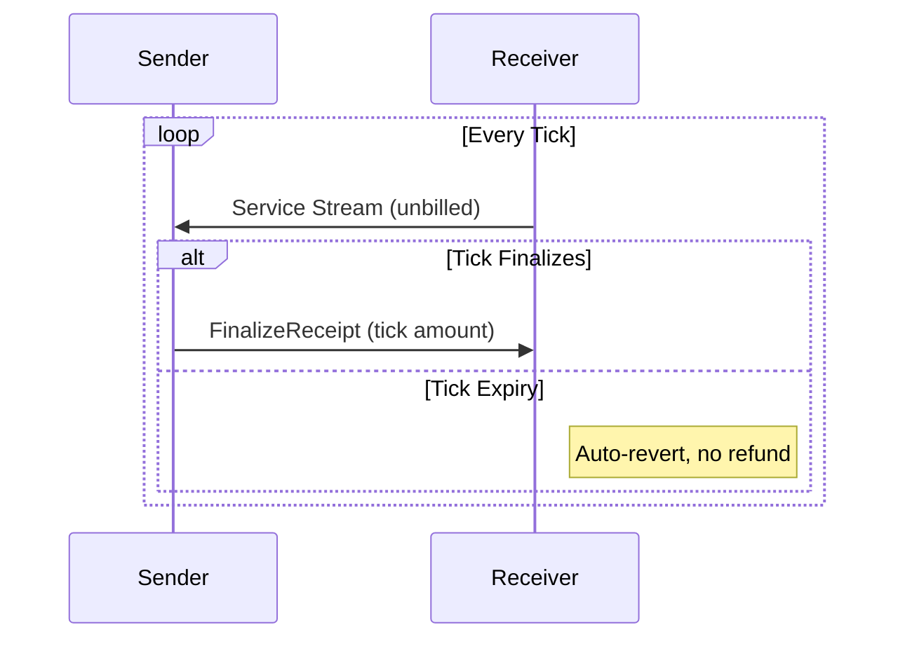

# Atomicity Design Report: Refutation of the Lightning Paradigm and Proposal for a Bounded-Trust Model

---

## 0. Purpose

This document attempts to reconcile differing views on the design of Atomicity. It explains where the Lightning-inspired framing leads to incorrect assumptions, proposes alternative primitives consistent with Atomicity’s goals, and specifies a design that is both minimal and implementable. The report also clarifies how streaming payments might be supported without violating safety.

Atomicity is **not** intended as a Lightning replica. It is a **bounded-trust credit routing protocol**:
- No blockchain, no global log.
- No reliance on refunds.
- No receiver-side partials.
- Losses are bounded and reputationally visible.
- Settlement is external (via Paykit, LN, on-chain, fiat, or contracts).

---

## 1. The Paradigm Gap: Lightning vs. Atomicity

### Lightning’s Assumptions
- **Atomic multi-hop commit** is enforced by the blockchain.
- **Refunds** are implicit in HTLCs: if the preimage isn’t revealed, money reverts.
- **Routing reliability** comes from global gossip of channel states.
- **Fees** are deducted in-flight and encoded in HTLCs.

### Atomicity’s Goals
- **Bounded trust fabric:** credit routing across peers; no global ledger.
- **Expiry, not refunds:** state either finalizes or reverts locally.
- **Local routing indexes:** built from peer data; privacy-preserving.
- **Explicit fees and credit terms:** machine-detectable mismatches.
- **Auditability and reputation:** the deterrent to fraud.

**Conclusion:** The “decentralized atomic commit problem” is not Atomicity’s problem. Our aim is to never enter unsafe states that would require it.

---

## 2. Refutations and Replacement Designs

### 2.1 Commit & Atomicity
**Claim:** Without decentralized commit, receivers face partials.  
**Refutation:** We eliminate partials through **Conditional Activation with Auto-Revert**.

- States per hop: `available → held → active* → active`.
- `active*` becomes `active` only if the **receiver issues a FinalizeReceipt** within the commit window.
- Otherwise all holds auto-revert.

**Tradeoff:** Receiver must explicitly finalize. This is acceptable because it ensures payments are all-or-nothing.



---

### 2.2 Refunds
**Claim:** Refunds are fragile and unreliable.  
**Refutation:** Refunds are eliminated.

- Receiver never recognizes partial fragments until Finalize.
- Failed attempts auto-revert without any receiver action.

**Tradeoff:** Sender bears probing costs, but bounded by local policy (`max_probe_spend`).



---

### 2.3 Routing
**Claim:** Without global visibility, routing is unreliable.  
**Refutation:** Routing does not require omniscience, only **bounded-cost empiricism**.

- **Personal routing indexes** (via Nexus or direct homeserver pulls).
- **Probes with TTL and budget caps** give reliability without global exposure.
- **Short-lived RoutingOffers** with explicit expiry keep paths fresh.

**Tradeoff:** Routing efficiency is lower than Lightning’s global gossip, but privacy is higher and cost is bounded.

---

### 2.4 Fees and Skimming
**Claim:** Hidden fees blur the line between loss and pricing.  
**Refutation:** Fees are explicit and verifiable.

- Two knobs: **routing fee** and **credit yield (interest)**.
- **HopReceipts** include `policy_hash`; mismatches are tagged as `fee_mismatch`.
- Deviations are visible and reputationally punished.

**Tradeoff:** Requires honest publication of policies. Cheaters are not cryptographically slashed, but reputationally excluded.

---

### 2.5 On-Demand Credit Issuers (ODCIs)
**Claim:** Backstops are meaningless without enforcement.  
**Refutation:** They are optional market roles.

- Operate under the same CV/Finalize/auto-revert rules.
- Wallets choose whether to trust and pay them.

**Tradeoff:** ODCIs cannot be universally trusted; they succeed or fail based on reputation.

---

### 2.6 Global State and Finality
**Claim:** Without global state, you can’t know true balances.  
**Refutation:** Atomicity doesn’t need a “true global state.”

- Safety relies on **local state machines** and expiry, not universal knowledge.
- Logs (HopReceipts, manifests) are published to homeservers, mirrored, and optionally indexed by Nexus.
- Reputation is derived from partial, not universal, knowledge.

**Tradeoff:** No single ground truth of credit state exists. Users tolerate bounded ambiguity in exchange for resilience and decentralization.

---

## 3. Streaming Payments: Refutation and Alternatives

### Unsafe Paradigm (to be rejected)
- **Finalize-on-arrival streaming fragments.**
- Receiver accrues partials as debt.
- If stream halts, refunds or social punishment are required.



⚠️ **Problem**: Partial recognition at receiver, refund path required.

---

### Safe Alternatives

#### 3.1 Prepaid Buckets (top-up balances)


---

#### 3.2 Windowed Micro-Intents


---

#### 3.3 Postpaid Ticks


**Tradeoffs:**
- Prepaid: efficient, but locks sender funds upfront.
- Micro-intents: finer-grained, higher overhead.
- Ticks: efficient for trusted peers, riskier if trust is misplaced.

All preserve invariants: no refunds, no partials, bounded sender loss.

---

## 4. Protocol Properties

- **P1:** Receiver never holds stuck partials.
- **P2:** No irreversible debt without receiver Finalize.
- **P3:** Refunds do not exist as a mechanism.
- **P4:** Sender’s probing/routing loss is bounded.
- **P5:** Pricing is explicit; mismatches detectable.
- **P6:** Optional backstops obey same rules.
- **P7:** Safety is local; no reliance on global state.
- **P8 (streaming):** Continuous payments possible via prepaid, micro-intents, or ticks—without violating invariants.

---

## 5. Testing and Falsification

1. **Partial commit attempt:** Ensure `active*` states auto-revert if no Finalize arrives.  
2. **Refund attempt:** Verify protocol produces no refund states.  
3. **Fee mismatch:** Induce hop to overcharge; check mismatch detection and tagging.  
4. **Routing grief:** Flood probes; confirm `max_probe_spend` caps sender exposure.  
5. **Streaming failure:** Halt mid-window; verify no partial recognition at receiver.  
6. **Homeserver offline:** Receiver unavailable; ensure auto-revert triggers.

---

## 6. Summary

Bryan’s report correctly identifies problems with Lightning-style assumptions, but errs by treating them as **unsolved requirements** instead of **designs we explicitly reject**.

- We do not seek decentralized atomic commit; we prevent unsafe states.
- We do not rely on refunds; they are removed.
- We do not need global state; safety is local.
- We do not tolerate implicit fees; pricing is explicit.
- Streaming is possible, but only with prepaid, micro-intent, or ticked models that respect the invariants.

**Atomicity is a bounded-trust, reputational credit routing protocol. Its correctness comes from eliminating unsafe states, not enforcing global consensus.**

---

## Areas for Improvement

1. Reputation System Improvements

The reliance on a partial, localized reputation system is vulnerable to Sybil attacks. An improved design could integrate cryptographic attestations to create a more resilient reputation model without resorting to a global ledger.

Potential Solution: Attestation-Based Reputation. 

Instead of solely relying on peer-to-peer reputation, the system could introduce attestations. When a transaction is finalized successfully, the sender and receiver could cryptographically sign a receipt confirming the success. These signed receipts, or attestations, could be published to their homeservers. Other nodes could then query these attestations to verify a peer's track record. A reputation score would not just be a subjective rating but a quantifiable measure based on the number and value of signed attestations a node has accumulated, making Sybil attacks more costly and less effective.

2. Routing Efficiency Enhancement

The current design's routing is based on local probes and indexes, which is private but potentially inefficient. A hybrid approach could improve path-finding speed without compromising the core tenet of bounded-trust and privacy.

Potential Solution: Limited, Controlled Information Sharing. 

The protocol could introduce a new type of message called a "Routing Signal". When a node successfully completes a transaction, it could broadcast a privacy-preserving signal to its direct peers, indicating that a path to a certain network region (e.g., a cluster of nodes) was found to be successful for a specific amount range. This signal would not reveal the full path or transaction details, but would serve as a hint to other nodes, helping them to prioritize probes in more promising directions. This creates a low-overhead, indirect form of "gossip" that is opt-in and does not reveal sensitive information.

3. Mitigating the FinalizeReceipt Bottleneck

The potential for a transaction to auto-revert due to a receiver's node being offline after a successful payment is a significant user experience issue. The design can be improved by adding a mechanism for a trusted recovery agent to handle this scenario.

Potential Solution: Designated Recovery Agent. 

A receiver could designate a trusted "Recovery Agent" (a third-party node or a homeserver) that is authorized to issue a FinalizeReceipt on their behalf if the receiver's node is non-responsive. Before a payment is sent, the sender could verify the existence of this agent's public key. If the receiver's node doesn't respond within the TTL, the sender could send the Finalize request to the recovery agent. This agent, upon verifying the state and a pre-signed contract, would issue the FinalizeReceipt, ensuring the payment is not lost due to temporary node downtime. This keeps the core principle of auto-revert intact, but adds a safety net.

4. Refining Streaming Payment Models

The three proposed streaming models each have a significant trade-off. A more flexible, hybrid model could combine the benefits of each without introducing new risks.

Potential Solution: Adaptive Hybrid Streaming. 

Instead of a single model, the protocol could support an adaptive approach where the sender and receiver negotiate a streaming method based on trust and network conditions.

For a highly trusted, low-latency connection, they could use a Postpaid Ticks model.

For a less trusted or higher-latency connection, they could begin with a small Prepaid Bucket and then dynamically switch to a Micro-Intent model for finer control.

The protocol could also introduce a "Conditional Top-Up" mechanism, where the sender's node automatically sends a new prepaid bucket as soon as the previous one's balance drops below a certain threshold, essentially automating the Prepaid model and reducing user friction.

These are solid directions. Here’s a clinical take on each, with trade-offs and **minimal spec deltas** so your team can adopt (or reject) them without derailing the core design.

---

## 1) Attestation-Based Reputation (to harden against Sybil)

**Assessment**

* 👍 Moves reputation from “opinions” to **verifiable history** (signed receipts).
* 👍 Makes Sybil attacks **costly**: a fresh identity has zero attestations of value/tenor.
* ⚠️ Doesn’t eliminate Sybil by itself; you still need per-origin rate limits/stamps and local trust policies.
* ⚠️ Privacy: publishing raw counterparties/amounts can leak graph structure.

**Spec delta (minimal)**

* Treat every **FinalizeReceipt** and **completed HopReceipt** as an **Attestation** (already signed).
* Publish **summaries** instead of raw edges to protect privacy:

  * count, total\_amount, median\_amount, success\_rate, window.
  * optional ZK or coarse bucketing (amount bands, time buckets) if you need stronger privacy later.

```json
// Attestation summary published by a homeserver (per peer or per-role)
{
  "v":1,
  "subject":"pk:PEER",              // the peer being attested about (optional; or hashed)
  "window":"30d",
  "tx_count":128,
  "amount_bands":{"<10k":70, "10k-100k":45, ">100k":13},
  "success_rate":0.93,
  "median_latency_ms":420,
  "proof_root":"mh:Qm...",          // Merkle root of underlying receipt ids (optional)
  "sig_publisher":"ed25519:..."
}
```

**Implementation notes**

* Wallet reputation score = weighted function of (age × value × window × variance). Decay aggressively (e.g., half-life ≤ 30d).
* Optionally **batch-anchor** Merkle roots via OpenTimestamps (OTS) for audit integrity (off fast-path).
* Gate influence: cap per-origin weight to blunt Sybil fan-out.

---

## 2) “Routing Signals” (low-leak, opt-in hints)

**Assessment**

* 👍 Can improve probe efficiency without global gossip.
* ⚠️ Any broadcast leaks **some** info; keep it **coarse** and **local**.
* ⚠️ Risk of manipulation (spammy “success” signals). Must be rate-limited and attributable.

**Spec delta**

* Define an optional **RoutingSignal** message peers may emit to **direct neighbors only** (not network-wide):

```json
{
  "v":1,
  "origin":"pk:ME",
  "region_hint":"hash(pk:Dave)||cluster_id", // opaque, not a path
  "amount_band":"10k-50k",
  "observed":"success|failure",
  "sample":17,                      // sample size supporting the hint
  "ttl_sec":120,                    // auto-expire
  "sig":"ed25519:..."
}
```

**Policy**

* Accept only from authenticated neighbors you already transact with.
* Use as a **soft prior** in your local route scorer; never a hard rule.
* Rate-limit; drop duplicates; decay quickly (short TTL). Log abusers (reputation penalty).

---

## 3) Designated Recovery Agent for Finalize (receiver offline)

**Assessment**

* 👍 Addresses the biggest UX edge-case (receiver briefly offline).
* 👍 Preserves *no-refund* invariant if the agent can safely **co-sign** Finalize.
* ⚠️ Be meticulous with **delegation scope**, **revocation**, and **replay** controls.
* ⚠️ Agent must have enough state to verify the commit (or at least hold a pre-authorization).

**Spec delta**

* Add a **FinalizeDelegation** capability (issued by receiver’s Ring to an agent). Publish its **revocation status** in the receiver’s homeserver; optionally checkpoint its root in PKARR as a small hash.

```json
{
  "ver":1,
  "iss":"pk:RECEIVER_IDK",
  "sub":"pk:AGENT_DSK",
  "scope":["atomicity.finalize"],
  "constraints":{
    "max_amount":"200000",
    "per_intent":true,
    "aud":["pi:XYZ..."],            // bind to specific intents when possible
    "exp":"2025-10-05T12:00:00Z"
  },
  "sig":"ed25519:..."
}
```

* **Flow options (pick one):**

  1. **Co-signature path**: Receiver pre-signs a **FinalizePreauth** that the Agent can co-sign only if CV proof set is valid and within TTL.
  2. **Agent-only path**: Agent finalizes under strict constraints (per-intent, max\_amount, short expiry) and exposes evidence endpoints.

**Safety**

* Agent must return **proof bundle** (CV set, CommitSignal, hop confirmations). Peers can soft-verify; disputes affect agent/receiver reputation.
* Immediate revocation via homeserver; wallets poll before honoring agent finalizes.

---

## 4) Adaptive Hybrid Streaming

**Assessment**

* 👍 Matches the real world: peers have different trust/latency.
* 👍 Can switch modes without changing invariants.
* ⚠️ Avoid mode-thrash (flapping); **hysteresis** and per-peer policy needed.

**Spec delta**

* Extend **PaymentIntent** with **streaming\_policy** and **auto\_topup** knobs:

```json
{
  "v":1,
  "id":"pi:...",
  "amount":"1000000",
  "require_full_delivery":true,
  "streaming_policy":{
    "mode":"prepaid|micro|ticks|auto",
    "window_ms":2000,               // for micro/ticks
    "min_bucket":"20000",           // for prepaid
    "switch_hysteresis":"10s"       // min time before switching mode
  },
  "auto_topup":{
    "threshold":"5000",
    "topup_amount":"15000",
    "max_concurrent":1
  }
}
```

**Behavior hints**

* Start conservatively (small **prepaid** bucket), then upgrade to **ticks** as success rate stabilizes.
* Drop to **micro-intents** on rising failure/latency; pause if windows time out consecutively.
* Always preserve **AON + Finalize + auto-revert** per window/bucket/tick.

---

# Do these fit the core principles?

* **No refunds / no receiver partials** — preserved.
* **Bounded sender loss** — preserved (caps on probes, windows, top-ups).
* **No global ledger** — preserved; optional OTS anchoring is off the hot path.
* **Privacy** — reasonable: signals are neighbor-only + coarse; attestations are summarized; raw receipts stay on homeservers.

---

# Recommended next steps (practical)

1. **Attestations**

   * Implement attestation summaries on homeserver; add Merkle root (optional OTS anchoring every N hours).
   * Wallet scorer: weight by value/tenor/age; implement caps per origin.

2. **Routing Signals (opt-in)**

   * Neighbor-only emission/ingest; 2-minute TTL; strict rate limits.
   * Integrate as a small positive bias in route scoring (don’t overfit).

3. **Recovery Agent (pilot)**

   * Start with **per-intent, short-lived delegation**; agent must return proof bundle.
   * Wallets check revocation before accepting agent’s Finalize.

4. **Adaptive Streaming**

   * Implement **prepaid** + **micro-intents** first; add **ticks** behind a flag.
   * Add **auto\_topup** with hysteresis to avoid flapping.


