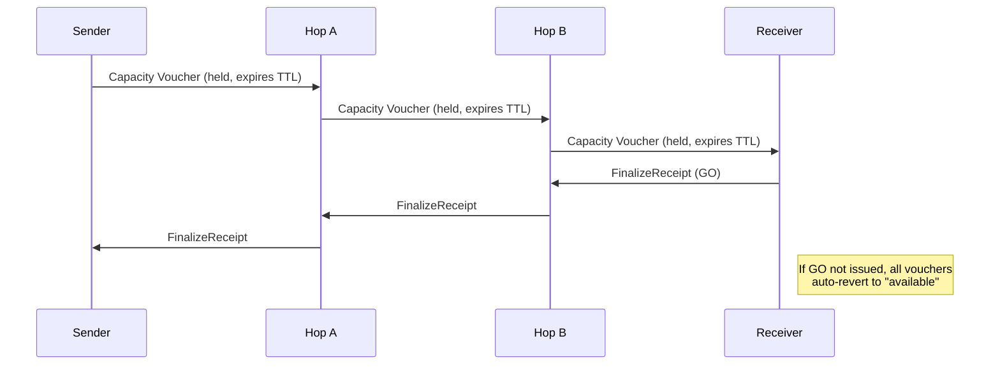
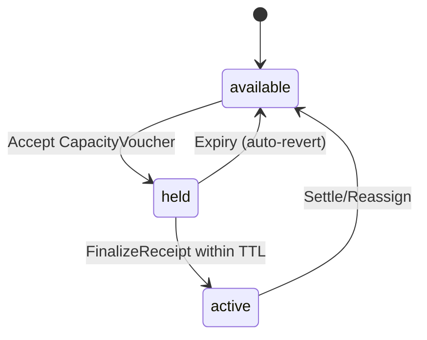
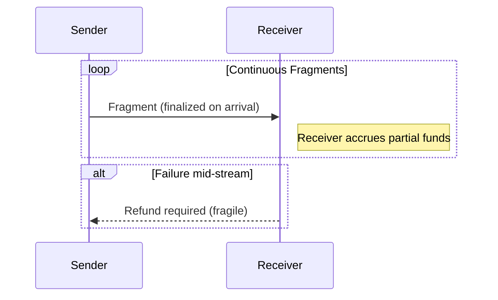
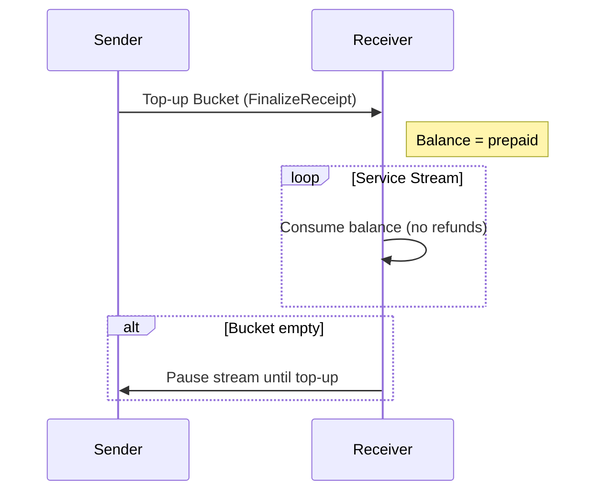
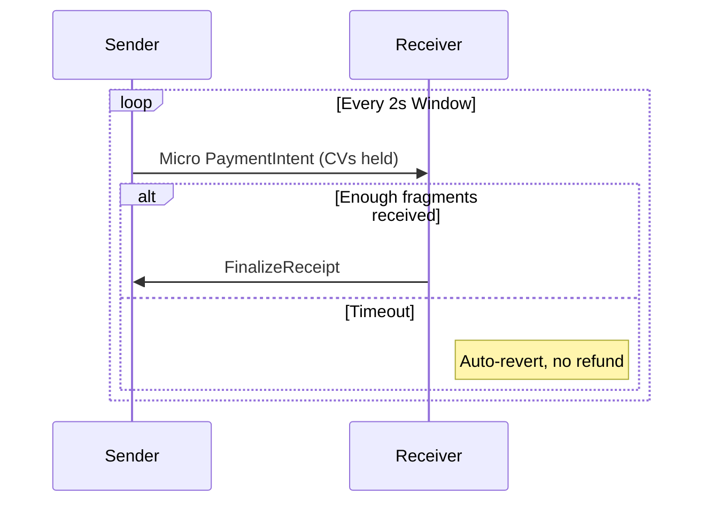
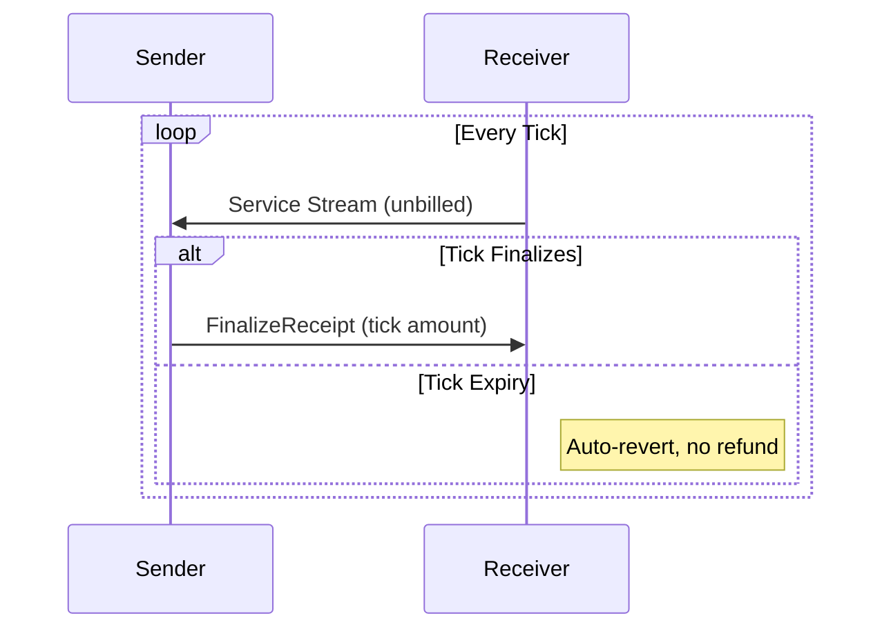

# Atomicity Design Report: Refutation of the Lightning Paradigm and Proposal for a Bounded-Trust Model

---

## 0. Purpose

This document attempts to reconcile differing views on the design of Atomicity. It explains where the Lightning-inspired framing leads to incorrect assumptions, proposes alternative primitives consistent with Atomicity’s goals, and specifies a design that is both minimal and implementable. The report also clarifies how streaming payments might be supported without violating safety.

Atomicity is **not** intended as a Lightning replica. It is a **bounded-trust credit routing protocol**:
- No blockchain, no global log.
- No reliance on refunds.
- No receiver-side partials.
- Losses are bounded and reputationally visible.
- Settlement is external (via Paykit, LN, on-chain, fiat, or contracts).

---

## 1. The Paradigm Gap: Lightning vs. Atomicity

### Lightning’s Assumptions
- **Atomic multi-hop commit** is enforced by the blockchain.
- **Refunds** are implicit in HTLCs: if the preimage isn’t revealed, money reverts.
- **Routing reliability** comes from global gossip of channel states.
- **Fees** are deducted in-flight and encoded in HTLCs.

### Atomicity’s Goals
- **Bounded trust fabric:** credit routing across peers; no global ledger.
- **Expiry, not refunds:** state either finalizes or reverts locally.
- **Local routing indexes:** built from peer data; privacy-preserving.
- **Explicit fees and credit terms:** machine-detectable mismatches.
- **Auditability and reputation:** the deterrent to fraud.

**Conclusion:** The “decentralized atomic commit problem” is not Atomicity’s problem. Our aim is to never enter unsafe states that would require it.

---

## 2. Refutations and Replacement Designs

### 2.1 Commit & Atomicity
**Claim:** Without decentralized commit, receivers face partials.  
**Refutation:** We eliminate partials through **Conditional Activation with Auto-Revert**.

- States per hop: `available → held → active* → active`.
- `active*` becomes `active` only if the **receiver issues a FinalizeReceipt** within the commit window.
- Otherwise all holds auto-revert.

**Tradeoff:** Receiver must explicitly finalize. This is acceptable because it ensures payments are all-or-nothing.

---

### 2.2 Refunds
**Claim:** Refunds are fragile and unreliable.  
**Refutation:** Refunds are eliminated.

- Receiver never recognizes partial fragments until Finalize.
- Failed attempts auto-revert without any receiver action.

**Tradeoff:** Sender bears probing costs, but bounded by local policy (`max_probe_spend`).

---

### 2.3 Routing
**Claim:** Without global visibility, routing is unreliable.  
**Refutation:** Routing does not require omniscience, only **bounded-cost empiricism**.

- **Personal routing indexes** (via Nexus or direct homeserver pulls).
- **Probes with TTL and budget caps** give reliability without global exposure.
- **Short-lived RoutingOffers** with explicit expiry keep paths fresh.

**Tradeoff:** Routing efficiency is lower than Lightning’s global gossip, but privacy is higher and cost is bounded.

---

### 2.4 Fees and Skimming
**Claim:** Hidden fees blur the line between loss and pricing.  
**Refutation:** Fees are explicit and verifiable.

- Two knobs: **routing fee** and **credit yield (interest)**.
- **HopReceipts** include `policy_hash`; mismatches are tagged as `fee_mismatch`.
- Deviations are visible and reputationally punished.

**Tradeoff:** Requires honest publication of policies. Cheaters are not cryptographically slashed, but reputationally excluded.

---

### 2.5 On-Demand Credit Issuers (ODCIs)
**Claim:** Backstops are meaningless without enforcement.  
**Refutation:** They are optional market roles.

- Operate under the same CV/Finalize/auto-revert rules.
- Wallets choose whether to trust and pay them.

**Tradeoff:** ODCIs cannot be universally trusted; they succeed or fail based on reputation.

---

### 2.6 Global State and Finality
**Claim:** Without global state, you can’t know true balances.  
**Refutation:** Atomicity doesn’t need a “true global state.”

- Safety relies on **local state machines** and expiry, not universal knowledge.
- Logs (HopReceipts, manifests) are published to homeservers, mirrored, and optionally indexed by Nexus.
- Reputation is derived from partial, not universal, knowledge.

**Tradeoff:** No single ground truth of credit state exists. Users tolerate bounded ambiguity in exchange for resilience and decentralization.

---

## 3. Streaming Payments: Refutation and Alternatives

### Unsafe Paradigm (to be rejected)
- **Finalize-on-arrival streaming fragments.**
- Receiver accrues partials as debt.
- If stream halts, refunds or social punishment are required.

⚠️ **Problem**: Partial recognition at receiver, refund path required.

---

### Safe Alternatives

#### 3.1 Prepaid Buckets (top-up balances)

---

#### 3.2 Windowed Micro-Intents

---

#### 3.3 Postpaid Ticks

**Tradeoffs:**
- Prepaid: efficient, but locks sender funds upfront.
- Micro-intents: finer-grained, higher overhead.
- Ticks: efficient for trusted peers, riskier if trust is misplaced.

All preserve invariants: no refunds, no partials, bounded sender loss.

---

## 4. Protocol Properties

- **P1:** Receiver never holds stuck partials.
- **P2:** No irreversible debt without receiver Finalize.
- **P3:** Refunds do not exist as a mechanism.
- **P4:** Sender’s probing/routing loss is bounded.
- **P5:** Pricing is explicit; mismatches detectable.
- **P6:** Optional backstops obey same rules.
- **P7:** Safety is local; no reliance on global state.
- **P8 (streaming):** Continuous payments possible via prepaid, micro-intents, or ticks—without violating invariants.

---

## 5. Testing and Falsification

1. **Partial commit attempt:** Ensure `active*` states auto-revert if no Finalize arrives.  
2. **Refund attempt:** Verify protocol produces no refund states.  
3. **Fee mismatch:** Induce hop to overcharge; check mismatch detection and tagging.  
4. **Routing grief:** Flood probes; confirm `max_probe_spend` caps sender exposure.  
5. **Streaming failure:** Halt mid-window; verify no partial recognition at receiver.  
6. **Homeserver offline:** Receiver unavailable; ensure auto-revert triggers.

---

## 6. Summary

Bryan’s report correctly identifies problems with Lightning-style assumptions, but errs by treating them as **unsolved requirements** instead of **designs we explicitly reject**.

- We do not seek decentralized atomic commit; we prevent unsafe states.
- We do not rely on refunds; they are removed.
- We do not need global state; safety is local.
- We do not tolerate implicit fees; pricing is explicit.
- Streaming is possible, but only with prepaid, micro-intent, or ticked models that respect the invariants.

**Atomicity is a bounded-trust, reputational credit routing protocol. Its correctness comes from eliminating unsafe states, not enforcing global consensus.**
