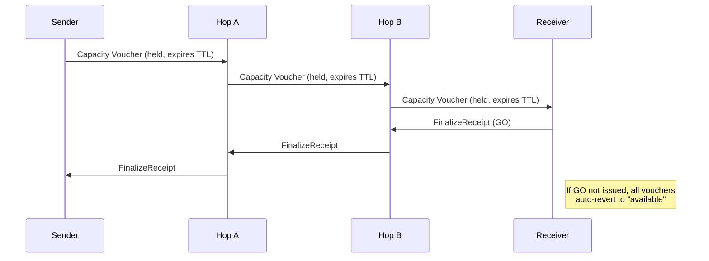
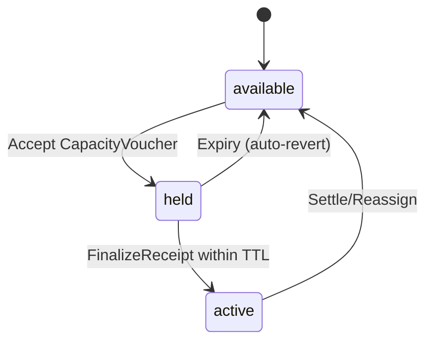
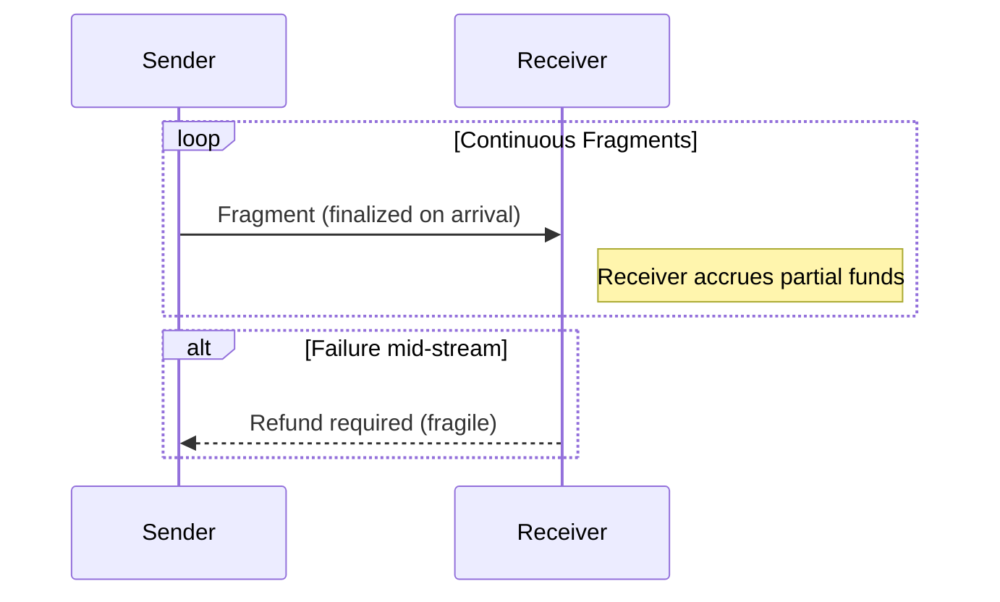
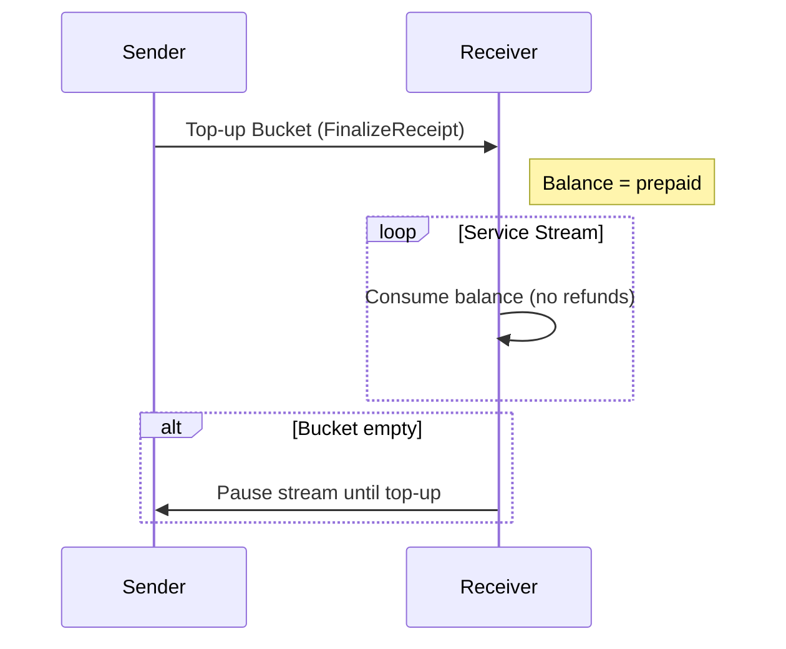
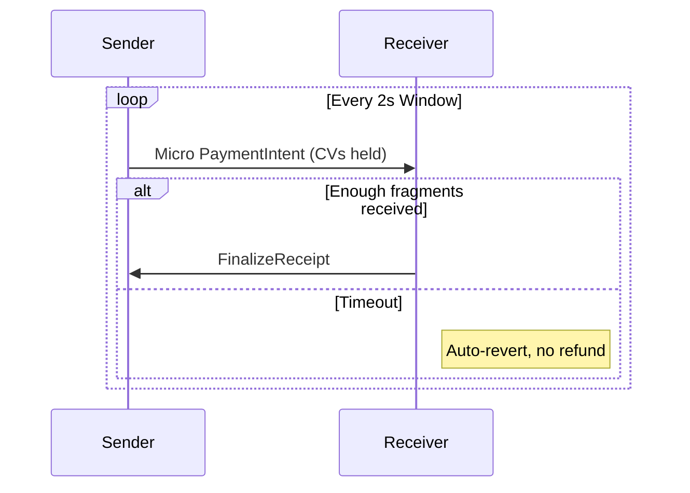
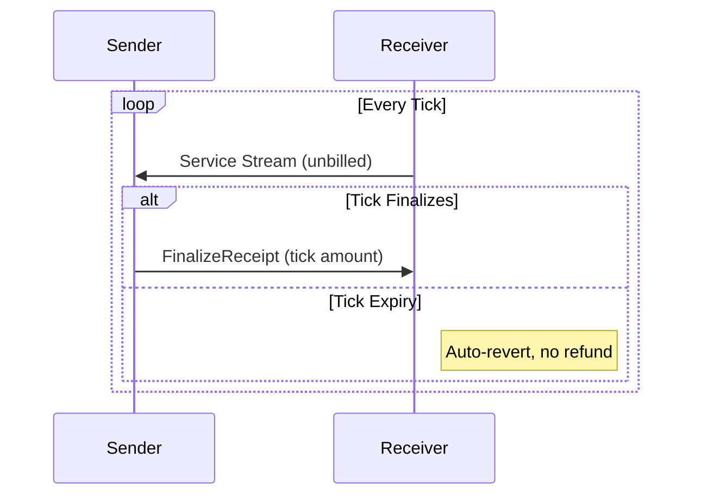

# Atomicity Design Report: Refutation of the Lightning Paradigm and Proposal for a Bounded-Trust Model

---

## 0. Purpose

This document attempts to reconcile differing views on the design of Atomicity. It explains where the Lightning-inspired framing leads to incorrect assumptions, proposes alternative primitives consistent with Atomicity’s goals, and specifies a design that is both minimal and implementable. The report also clarifies how streaming payments might be supported without violating safety.

Atomicity is **not** intended as a Lightning replica. It is a **bounded-trust credit routing protocol**:
- No blockchain, no global log.
- No reliance on refunds.
- No receiver-side partials.
- Losses are bounded and reputationally visible.
- Settlement is external (via Paykit, LN, on-chain, fiat, or contracts).

---

## 1. The Paradigm Gap: Lightning vs. Atomicity

### Lightning’s Assumptions
- **Atomic multi-hop commit** is enforced by the blockchain.
- **Refunds** are implicit in HTLCs: if the preimage isn’t revealed, money reverts.
- **Routing reliability** comes from global gossip of channel states.
- **Fees** are deducted in-flight and encoded in HTLCs.

### Atomicity’s Goals
- **Bounded trust fabric:** credit routing across peers; no global ledger.
- **Expiry, not refunds:** state either finalizes or reverts locally.
- **Local routing indexes:** built from peer data; privacy-preserving.
- **Explicit fees and credit terms:** machine-detectable mismatches.
- **Auditability and reputation:** the deterrent to fraud.

**Conclusion:** The “decentralized atomic commit problem” is not Atomicity’s problem. Our aim is to never enter unsafe states that would require it.

---

## 2. Refutations and Replacement Designs

### 2.1 Commit & Atomicity
**Claim:** Without decentralized commit, receivers face partials.  
**Refutation:** We eliminate partials through **Conditional Activation with Auto-Revert**.

- States per hop: `available → held → active* → active`.
- `active*` becomes `active` only if the **receiver issues a FinalizeReceipt** within the commit window.
- Otherwise all holds auto-revert.

**Tradeoff:** Receiver must explicitly finalize. This is acceptable because it ensures payments are all-or-nothing.



---

### 2.2 Refunds
**Claim:** Refunds are fragile and unreliable.  
**Refutation:** Refunds are eliminated.

- Receiver never recognizes partial fragments until Finalize.
- Failed attempts auto-revert without any receiver action.

**Tradeoff:** Sender bears probing costs, but bounded by local policy (`max_probe_spend`).



---

### 2.3 Routing
**Claim:** Without global visibility, routing is unreliable.  
**Refutation:** Routing does not require omniscience, only **bounded-cost empiricism**.

- **Personal routing indexes** (via Nexus or direct homeserver pulls).
- **Probes with TTL and budget caps** give reliability without global exposure.
- **Short-lived RoutingOffers** with explicit expiry keep paths fresh.

**Tradeoff:** Routing efficiency is lower than Lightning’s global gossip, but privacy is higher and cost is bounded.

---

### 2.4 Fees and Skimming
**Claim:** Hidden fees blur the line between loss and pricing.  
**Refutation:** Fees are explicit and verifiable.

- Two knobs: **routing fee** and **credit yield (interest)**.
- **HopReceipts** include `policy_hash`; mismatches are tagged as `fee_mismatch`.
- Deviations are visible and reputationally punished.

**Tradeoff:** Requires honest publication of policies. Cheaters are not cryptographically slashed, but reputationally excluded.

---

### 2.5 On-Demand Credit Issuers (ODCIs)
**Claim:** Backstops are meaningless without enforcement.  
**Refutation:** They are optional market roles.

- Operate under the same CV/Finalize/auto-revert rules.
- Wallets choose whether to trust and pay them.

**Tradeoff:** ODCIs cannot be universally trusted; they succeed or fail based on reputation.

---

### 2.6 Global State and Finality
**Claim:** Without global state, you can’t know true balances.  
**Refutation:** Atomicity doesn’t need a “true global state.”

- Safety relies on **local state machines** and expiry, not universal knowledge.
- Logs (HopReceipts, manifests) are published to homeservers, mirrored, and optionally indexed by Nexus.
- Reputation is derived from partial, not universal, knowledge.

**Tradeoff:** No single ground truth of credit state exists. Users tolerate bounded ambiguity in exchange for resilience and decentralization.

---

## 3. Streaming Payments: Refutation and Alternatives

### Unsafe Paradigm (to be rejected)
- **Finalize-on-arrival streaming fragments.**
- Receiver accrues partials as debt.
- If stream halts, refunds or social punishment are required.



⚠️ **Problem**: Partial recognition at receiver, refund path required.

---

### Safe Alternatives

#### 3.1 Prepaid Buckets (top-up balances)


---

#### 3.2 Windowed Micro-Intents


---

#### 3.3 Postpaid Ticks


**Tradeoffs:**
- Prepaid: efficient, but locks sender funds upfront.
- Micro-intents: finer-grained, higher overhead.
- Ticks: efficient for trusted peers, riskier if trust is misplaced.

All preserve invariants: no refunds, no partials, bounded sender loss.

---

## 4. Protocol Properties

- **P1:** Receiver never holds stuck partials.
- **P2:** No irreversible debt without receiver Finalize.
- **P3:** Refunds do not exist as a mechanism.
- **P4:** Sender’s probing/routing loss is bounded.
- **P5:** Pricing is explicit; mismatches detectable.
- **P6:** Optional backstops obey same rules.
- **P7:** Safety is local; no reliance on global state.
- **P8 (streaming):** Continuous payments possible via prepaid, micro-intents, or ticks—without violating invariants.

---

## 5. Testing and Falsification

1. **Partial commit attempt:** Ensure `active*` states auto-revert if no Finalize arrives.  
2. **Refund attempt:** Verify protocol produces no refund states.  
3. **Fee mismatch:** Induce hop to overcharge; check mismatch detection and tagging.  
4. **Routing grief:** Flood probes; confirm `max_probe_spend` caps sender exposure.  
5. **Streaming failure:** Halt mid-window; verify no partial recognition at receiver.  
6. **Homeserver offline:** Receiver unavailable; ensure auto-revert triggers.

---

## 6. Summary So Far

Bryan’s report correctly identifies problems with Lightning-style assumptions, but errs by treating them as **unsolved requirements** instead of **designs we explicitly reject**.

- We do not seek decentralized atomic commit; we prevent unsafe states.
- We do not rely on refunds; they are removed.
- We do not need global state; safety is local.
- We do not tolerate implicit fees; pricing is explicit.
- Streaming is possible, but only with prepaid, micro-intent, or ticked models that respect the invariants.

**Atomicity is a bounded-trust, reputational credit routing protocol. Its correctness comes from eliminating unsafe states, not enforcing global consensus.**

---

Here’s a concise **“Legal Design Principles”** section you can append directly to the Atomicity design report. It reinforces the guardrails without changing mechanics, so your team and Bryan stay aligned on compliance implications:

---

## 7. Legal Design Principles

Atomicity is designed to provide a **peer-to-peer credit routing fabric** without creating regulatory obligations that typically apply to financial intermediaries, clearinghouses, or custodians. The following principles guide its implementation:

1. **Bilateral Obligations Only**

   * All credit lines, vouchers, receipts, and attestations are strictly **between two peers**.
   * The protocol does not create network-wide liabilities or “system obligations.”

2. **Bounded Commitments**

   * Every promise is explicit, limited in scope, and time-bounded.
   * Expiry and auto-revert ensure that no open-ended or perpetual obligations exist.

3. **Voluntary Roles**

   * Routers, homeservers, indexers, recovery agents, and credit issuers are **optional helpers**.
   * No role is mandatory, and no single provider is indispensable.

4. **Subjective Reputation**

   * Reputation is derived from receipts and attestations, but remains **subjective to each peer**.
   * There is no authoritative or global reputation system.

5. **Settlement Is External**

   * Atomicity routes credit; it does not guarantee or enforce settlement.
   * Settlements may occur over Bitcoin, Lightning, fiat rails, or contractual arrangements, but these are **adapters outside the core protocol**.

6. **No Custodianship by Default**

   * Homeservers mirror and store user receipts, but they do not intermediate payments, hold balances, or act as fiduciaries.

By adhering to these principles, Atomicity remains a **neutral protocol** that can be used legally in peer-to-peer contexts, while leaving room for regulated entities to build compliant services on top.


## 8. Areas for Improvement

1. Reputation System Improvements

The reliance on a partial, localized reputation system is vulnerable to Sybil attacks. An improved design could integrate cryptographic attestations to create a more resilient reputation model without resorting to a global ledger.

Potential Solution: Attestation-Based Reputation. 

Instead of solely relying on peer-to-peer reputation, the system could introduce attestations. When a transaction is finalized successfully, the sender and receiver could cryptographically sign a receipt confirming the success. These signed receipts, or attestations, could be published to their homeservers. Other nodes could then query these attestations to verify a peer's track record. A reputation score would not just be a subjective rating but a quantifiable measure based on the number and value of signed attestations a node has accumulated, making Sybil attacks more costly and less effective.

2. Routing Efficiency Enhancement

The current design's routing is based on local probes and indexes, which is private but potentially inefficient. A hybrid approach could improve path-finding speed without compromising the core tenet of bounded-trust and privacy.

Potential Solution: Limited, Controlled Information Sharing. 

The protocol could introduce a new type of message called a "Routing Signal". When a node successfully completes a transaction, it could broadcast a privacy-preserving signal to its direct peers, indicating that a path to a certain network region (e.g., a cluster of nodes) was found to be successful for a specific amount range. This signal would not reveal the full path or transaction details, but would serve as a hint to other nodes, helping them to prioritize probes in more promising directions. This creates a low-overhead, indirect form of "gossip" that is opt-in and does not reveal sensitive information.

3. Mitigating the FinalizeReceipt Bottleneck

The potential for a transaction to auto-revert due to a receiver's node being offline after a successful payment is a significant user experience issue. The design can be improved by adding a mechanism for a trusted recovery agent to handle this scenario.

Potential Solution: Designated Recovery Agent. 

A receiver could designate a trusted "Recovery Agent" (a third-party node or a homeserver) that is authorized to issue a FinalizeReceipt on their behalf if the receiver's node is non-responsive. Before a payment is sent, the sender could verify the existence of this agent's public key. If the receiver's node doesn't respond within the TTL, the sender could send the Finalize request to the recovery agent. This agent, upon verifying the state and a pre-signed contract, would issue the FinalizeReceipt, ensuring the payment is not lost due to temporary node downtime. This keeps the core principle of auto-revert intact, but adds a safety net.

4. Refining Streaming Payment Models

The three proposed streaming models each have a significant trade-off. A more flexible, hybrid model could combine the benefits of each without introducing new risks.

Potential Solution: Adaptive Hybrid Streaming. 

Instead of a single model, the protocol could support an adaptive approach where the sender and receiver negotiate a streaming method based on trust and network conditions.

For a highly trusted, low-latency connection, they could use a Postpaid Ticks model.

For a less trusted or higher-latency connection, they could begin with a small Prepaid Bucket and then dynamically switch to a Micro-Intent model for finer control.

The protocol could also introduce a "Conditional Top-Up" mechanism, where the sender's node automatically sends a new prepaid bucket as soon as the previous one's balance drops below a certain threshold, essentially automating the Prepaid model and reducing user friction.

These are solid directions. Here’s a clinical take on each, with trade-offs and **minimal spec deltas** so your team can adopt (or reject) them without derailing the core design.

---

#### 8.1 Review of Potential Improvements

## 1) Attestation-Based Reputation (to harden against Sybil)

**Assessment**

* 👍 Moves reputation from “opinions” to **verifiable history** (signed receipts).
* 👍 Makes Sybil attacks **costly**: a fresh identity has zero attestations of value/tenor.
* ⚠️ Doesn’t eliminate Sybil by itself; you still need per-origin rate limits/stamps and local trust policies.
* ⚠️ Privacy: publishing raw counterparties/amounts can leak graph structure.

**Spec delta (minimal)**

* Treat every **FinalizeReceipt** and **completed HopReceipt** as an **Attestation** (already signed).
* Publish **summaries** instead of raw edges to protect privacy:

  * count, total\_amount, median\_amount, success\_rate, window.
  * optional ZK or coarse bucketing (amount bands, time buckets) if you need stronger privacy later.

```json
// Attestation summary published by a homeserver (per peer or per-role)
{
  "v":1,
  "subject":"pk:PEER",              // the peer being attested about (optional; or hashed)
  "window":"30d",
  "tx_count":128,
  "amount_bands":{"<10k":70, "10k-100k":45, ">100k":13},
  "success_rate":0.93,
  "median_latency_ms":420,
  "proof_root":"mh:Qm...",          // Merkle root of underlying receipt ids (optional)
  "sig_publisher":"ed25519:..."
}
```

**Implementation notes**

* Wallet reputation score = weighted function of (age × value × window × variance). Decay aggressively (e.g., half-life ≤ 30d).
* Optionally **batch-anchor** Merkle roots via OpenTimestamps (OTS) for audit integrity (off fast-path).
* Gate influence: cap per-origin weight to blunt Sybil fan-out.

---

## 2) “Routing Signals” (low-leak, opt-in hints)

**Assessment**

* 👍 Can improve probe efficiency without global gossip.
* ⚠️ Any broadcast leaks **some** info; keep it **coarse** and **local**.
* ⚠️ Risk of manipulation (spammy “success” signals). Must be rate-limited and attributable.

**Spec delta**

* Define an optional **RoutingSignal** message peers may emit to **direct neighbors only** (not network-wide):

```json
{
  "v":1,
  "origin":"pk:ME",
  "region_hint":"hash(pk:Dave)||cluster_id", // opaque, not a path
  "amount_band":"10k-50k",
  "observed":"success|failure",
  "sample":17,                      // sample size supporting the hint
  "ttl_sec":120,                    // auto-expire
  "sig":"ed25519:..."
}
```

**Policy**

* Accept only from authenticated neighbors you already transact with.
* Use as a **soft prior** in your local route scorer; never a hard rule.
* Rate-limit; drop duplicates; decay quickly (short TTL). Log abusers (reputation penalty).

---

## 3) Designated Recovery Agent for Finalize (receiver offline)

**Assessment**

* 👍 Addresses the biggest UX edge-case (receiver briefly offline).
* 👍 Preserves *no-refund* invariant if the agent can safely **co-sign** Finalize.
* ⚠️ Be meticulous with **delegation scope**, **revocation**, and **replay** controls.
* ⚠️ Agent must have enough state to verify the commit (or at least hold a pre-authorization).

**Spec delta**

* Add a **FinalizeDelegation** capability (issued by receiver’s Ring to an agent). Publish its **revocation status** in the receiver’s homeserver; optionally checkpoint its root in PKARR as a small hash.

```json
{
  "ver":1,
  "iss":"pk:RECEIVER_IDK",
  "sub":"pk:AGENT_DSK",
  "scope":["atomicity.finalize"],
  "constraints":{
    "max_amount":"200000",
    "per_intent":true,
    "aud":["pi:XYZ..."],            // bind to specific intents when possible
    "exp":"2025-10-05T12:00:00Z"
  },
  "sig":"ed25519:..."
}
```

* **Flow options (pick one):**

  1. **Co-signature path**: Receiver pre-signs a **FinalizePreauth** that the Agent can co-sign only if CV proof set is valid and within TTL.
  2. **Agent-only path**: Agent finalizes under strict constraints (per-intent, max\_amount, short expiry) and exposes evidence endpoints.

**Safety**

* Agent must return **proof bundle** (CV set, CommitSignal, hop confirmations). Peers can soft-verify; disputes affect agent/receiver reputation.
* Immediate revocation via homeserver; wallets poll before honoring agent finalizes.

---

## 4) Adaptive Hybrid Streaming

**Assessment**

* 👍 Matches the real world: peers have different trust/latency.
* 👍 Can switch modes without changing invariants.
* ⚠️ Avoid mode-thrash (flapping); **hysteresis** and per-peer policy needed.

**Spec delta**

* Extend **PaymentIntent** with **streaming\_policy** and **auto\_topup** knobs:

```json
{
  "v":1,
  "id":"pi:...",
  "amount":"1000000",
  "require_full_delivery":true,
  "streaming_policy":{
    "mode":"prepaid|micro|ticks|auto",
    "window_ms":2000,               // for micro/ticks
    "min_bucket":"20000",           // for prepaid
    "switch_hysteresis":"10s"       // min time before switching mode
  },
  "auto_topup":{
    "threshold":"5000",
    "topup_amount":"15000",
    "max_concurrent":1
  }
}
```

**Behavior hints**

* Start conservatively (small **prepaid** bucket), then upgrade to **ticks** as success rate stabilizes.
* Drop to **micro-intents** on rising failure/latency; pause if windows time out consecutively.
* Always preserve **AON + Finalize + auto-revert** per window/bucket/tick.

---

# Do these fit the core principles?

* **No refunds / no receiver partials** — preserved.
* **Bounded sender loss** — preserved (caps on probes, windows, top-ups).
* **No global ledger** — preserved; optional OTS anchoring is off the hot path.
* **Privacy** — reasonable: signals are neighbor-only + coarse; attestations are summarized; raw receipts stay on homeservers.

---

# Recommended next steps (practical)

1. **Attestations**

   * Implement attestation summaries on homeserver; add Merkle root (optional OTS anchoring every N hours).
   * Wallet scorer: weight by value/tenor/age; implement caps per origin.

2. **Routing Signals (opt-in)**

   * Neighbor-only emission/ingest; 2-minute TTL; strict rate limits.
   * Integrate as a small positive bias in route scoring (don’t overfit).

3. **Recovery Agent (pilot)**

   * Start with **per-intent, short-lived delegation**; agent must return proof bundle.
   * Wallets check revocation before accepting agent’s Finalize.

4. **Adaptive Streaming**

   * Implement **prepaid** + **micro-intents** first; add **ticks** behind a flag.
   * Add **auto\_topup** with hysteresis to avoid flapping.
  
---

## 9. Economic Considerations

Atomicity is potentially more than “a p2p credit system” if imagined as the **fabric** that finance (and external punishment/contract systems) anchor onto. Then the most elegant path is a **minimal core** with clean, composable economics. Here’s a design that treats routing, netting, credit creation, and enforcement as *markets* sitting on a tiny set of primitives.

## A. State & Accounting Invariants

* **Identity:** Pubkey identities (Pubky/Ring for delegation).
* **Edge:** A bilateral **credit line** `A↔B` with:

  * `limit`, `balance` (signed double-entry), `rate` (bps), `expiry`, `grace`, `haircut`.
* **Claim:** A signed, append-only **receipt** of an event (hold, activate, reassign, net, settle).
* **Conservation:** Every edge update is paired (A’s asset = B’s liability). No “free value” can appear.
* **Time:** Everything has **TTL/expiry**. No immortal promises.

> Minimal wire objects: `PaymentIntent`, `CapacityVoucher`, `FinalizeReceipt`, `HopReceipt`, `Reassign`, `NettingSet`, `SettlementReceipt`.

## B. Execution Invariants (safety)

* **Conditional activation + auto-revert:** No refunds; nothing “sticks” without **receiver finalize** inside a short commit window.
* **All-or-nothing at the receiver:** AON buffer; either total meets `min_deliverable` → finalize, or it all lapses.
* **Bounded sender loss:** Probe budgets, per-window caps, stamped/PoW probes if needed.

That’s the whole kernel. Everything below builds on it.

---

# Markets on Top of the Core

## 1) Routing as a Market

* **Supply:** Paths offering capacity and latency; advertised via short-TTL **RoutingOffers** with explicit fees (bps/flat) and policy hashes.
* **Demand:** PaymentIntents with `max_fee`, `latency`, `success_prob` targets.
* **Price Discovery:** Wallets choose offers; **fee mismatches** are detectable from HopReceipts → reputation/shunning.
* **Zero-fee routes (when netting):** Fee=0 can be *required* for any hop whose exposure is decreased or unchanged by **same-cycle netting** (see Netting). The protocol flags “net-beneficial hop” so wallets can enforce “fee must be ≤ X” on those hops.

## 2) Credit on Demand (CoD) as a Market

* **Role:** CoD issuers sell *temporary* limits along missing edges to make routes possible.
* **Instrument:** A signed **TemporaryLimit** (like a voucher) with `amount`, `rate`, `expiry`, `haircut`.
* **Pricing:** Explicit **carry** (interest/spread), not hidden skim.
* **Risk Controls:** Haircuts, expiries, and per-issuer caps; receipts make performance measurable → reputation.

> Outcome: “credit creation” is explicit, priced, and revocable by time — not magic. It composes naturally with routing.

## 3) Insurance / Backstops

* **Role:** Sell protection on a path/intent (pay on shortfall).
* **Mechanics:** Reference the same receipts; pay when `delivered < intent.amount` after expiry.
* **Incentives:** They prefer routes/hops with better reputation; they price to loss history.

> You get reliability without hard enforcement — via competitive pricing and receipts-based adjudication.

---

# Netting as a First-Class Clearing Layer

## Multilateral Netting Sets

* **Definition:** A **NettingSet** is a bounded batch (time-windowed or event-bounded) of edges `{E_i}` across a subgraph with a solver producing **net reassignments** minimizing gross exposure subject to limits/expiries.
* **Receipt:** `NettingReceipt` lists (before, after) exposures for each edge; signed by participants (or by policy-authorized netting coordinator), then **Finalized** exactly like payments (AON + auto-revert if not finalized).
* **Fee Rule (elegant & enforceable):**

  * For each hop `H` in a netting set:

    * If `exposure_after ≤ exposure_before` (hop’s net risk ↓), **routing fee must be 0** (or below a small cap), because the hop is paid by risk reduction.
    * If `exposure_after > exposure_before`, fees are allowed but bounded by the published policy.
* **Why it works:** We align fees with *marginal risk*. Netting is a risk-reduction service; you shouldn’t pay someone to reduce their own risk.

> In practice, netting can run continuously in small windows (e.g., per minute). Wallets opt-in per intent with `allow_netting: true`.

---

# Streaming Without Breaking Safety

Support three **payment “shapes”** using the same kernel:

1. **Prepaid Buckets** — top-up once (Finalize), receiver debits as it streams. Pause when empty. No refunds.
2. **Windowed Micro-Intents** — rolling 1–3s windows, each an AON commitment (Finalize or lapse). Fine-grained, higher overhead, safest.
3. **Postpaid Ticks** — trusted peers stream service; every tick finalizes or lapses. Efficient when trust is strong.

All preserve: no refunds, no receiver partials, bounded sender exposure.

---

# Contract Hooks (Punishments / External Enforcement)

Keep the core enforcement-agnostic, but expose **anchors**:

* **DLC/DVM Anchor:** Any receipt (Finalize, Netting, Settlement) is hash-addressed. A contract (e.g., DLC) references the hash to unlock collateral based on outcome.
* **Bond/Fidelity Anchor:** CoD issuers or routers can post **capability-scoped bonds** (time-locked outputs, multisig), with a published **payout policy** keyed to receipts (e.g., pay out on `fee_mismatch` or non-delivery).
* **Legal/Arb Anchor:** Receipts form an evidentiary chain; exportable bundle for off-chain adjudication.

> The protocol **never** requires these; it just makes them trivial to attach later, per relationship.

---

# Where Economics Live (and don’t)

* **Inside the core:** explicit fee fields, explicit carry (interest), haircuts, expiries, and netting rules. These shape incentives and make pricing visible.
* **Outside the core:** policy decisions (who pays what, how much) are per market role and discoverable via offers, not baked into consensus.

This separation keeps the kernel tiny and the markets composable.

---

# Why this scales to “fabric for all finance”

* **Completeness:** You can express credit creation, clearing/netting, routing, insurance, and settlement hand-offs with five receipt types and a double-entry edge model.
* **Orthogonality:** Payments, netting, and settlement share the same AON+Finalize+Expiry mechanics.
* **Extensibility:** New roles (auctioneers, FX market-makers, factoring desks) just publish offers and issue receipts; nothing new at the kernel.
* **Observability:** Everything meaningful is a signed receipt; reputation and pricing work off the same substrate.

---

# What to ship (actionable for engineering)

1. **Schemas & Canonicalization**

   * `Edge`, `RoutingOffer`, `PaymentIntent`, `CapacityVoucher`, `FinalizeReceipt`, `HopReceipt`, `Reassign`, `NettingSet`, `NettingReceipt`, `SettlementReceipt`, `TemporaryLimit` (CoD).
2. **State Machines**

   * Per-hop: `available → held → active* → active → (settle/net/reassign)`.
   * Receiver AON buffer; streaming windows/ticks are just short-cycle intents.
3. **Netting Engine (v0)**

   * Greedy bilateral reassignments first; optional MILP/flow solver later.
   * Fee rule baked in (“risk-reducing hop = zero/low fee”).
4. **Market APIs**

   * `offers/query`, `cv/request`, `finalize`, `receipts/append`, `netting/propose`, `netting/finalize`, `cod/quote`, `cod/issue`.
5. **Pricing & Policy**

   * Wallet policy: `max_fee_bps`, `max_probe_spend`, `allow_netting`, `allow_cod`, `min_net_gain_bps`.
   * Router/issuer policy: publish `policy_hash` in offers; enforce mismatch tagging.
6. **Reputation Plumbing**

   * Standard tags: `success`, `error_timeout`, `fee_mismatch`, `default`, `net_gain`.
   * 30-day decay, route-scoped stats.

---

# Open questions worth an economist’s eye (but not blockers)

* **Rate surfaces:** How to parameterize carry vs. one-off fees so that rational routes emerge (e.g., default curves, duration bands)?
* **Haircuts:** Defaults by tenor & counterparty distance? (We can start with conservative fixed haircuts.)
* **CoD market microstructure:** Dutch auctions vs. RFQ; slippage protection in short windows.
* **Netting game theory:** Incentive-compatible disclosures so participants don’t game the solver (caps and verification help).

> These are *refinements*; the core still works with conservative defaults.

---

# Why this is the “most elegant” version

* **Small kernel, big surface:** A handful of receipts and state transitions support payments, streaming, netting, credit creation, insurance, and settlement.
* **Aligned incentives:** Fees where risk increases; zero/low fees where netting reduces risk; visible pricing; receipts back everything.
* **No refunds, no global log:** Safety from *not entering bad states*; reputation from receipts; optional enforcement via anchors.
* **Future-proof:** Contracts and punishment systems can latch on without changing the kernel.


